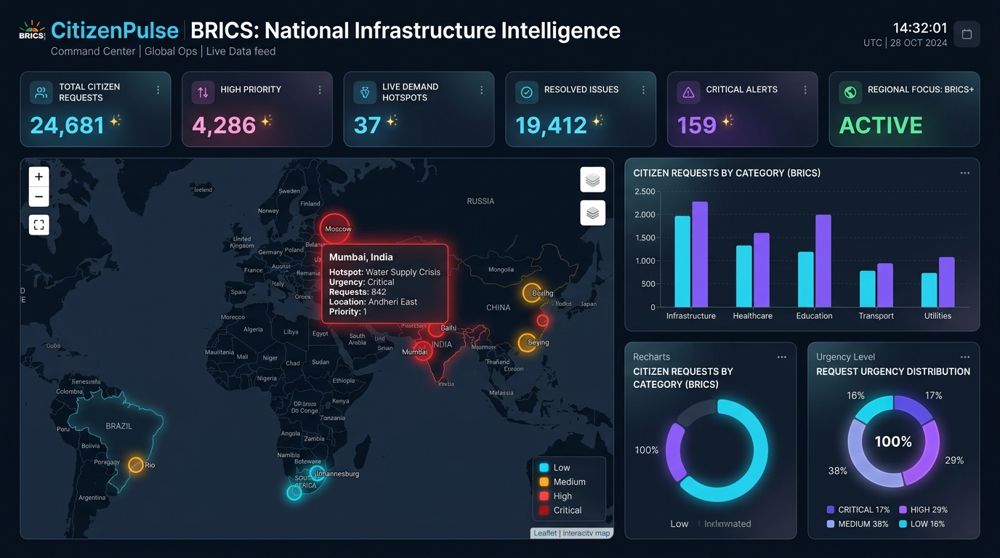
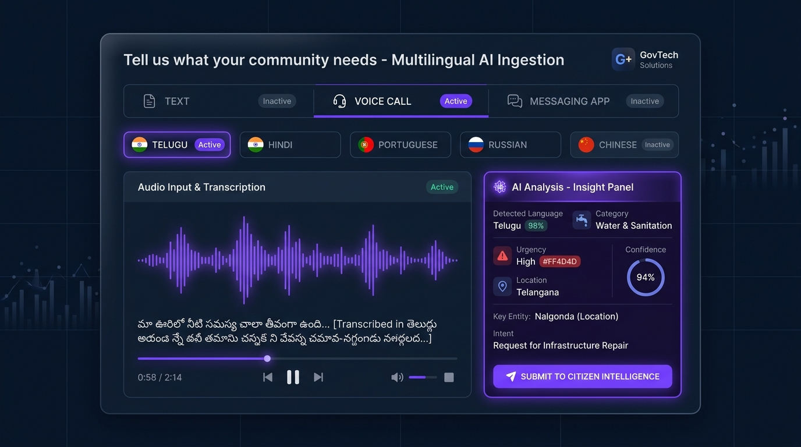

# CitizenPulse BRICS
### From Citizen Voice to Infrastructure Intelligence

> **BRICS Hackathon Submission Prototype** • *GovTech / Digital Public Infrastructure Platform*

---

### 🌐 **LIVE DEMO WEBSITE**:
👉 **[https://citizenpulsebrics-five.vercel.app](https://citizenpulsebrics-five.vercel.app)**

---

## 📸 Platform Screenshots

### 1. National Infrastructure Intelligence Command Center


### 2. Multilingual Citizen Signal Ingestion & AI Analysis


---

## 📌 Executive Summary

Governments across BRICS nations struggle to consolidate fragmented citizen requests arriving across voice calls, SMS, WhatsApp, local web forms, and diverse regional languages. **CitizenPulse BRICS** bridges this gap by deploying a unified AI pipeline that converts unstructured citizen feedback into evidence-based spatial infrastructure intelligence, explainable priority scores, executive policy briefs, and counterfactual impact simulations.

> 🌐 **Live Production Link**: [https://citizenpulsebrics-five.vercel.app](https://citizenpulsebrics-five.vercel.app)  
> 📁 **GitHub Repository**: [https://github.com/reddysrihith/citizenpulse-brics](https://github.com/reddysrihith/citizenpulse-brics)  
> 
> ⚠️ **Synthetic Data Notice**: All datasets in this prototype platform are synthetically generated demo datasets and do not represent classified government records.

---

## 🚀 Key Innovation Pipeline

```
Citizen Signal (Voice / SMS / WhatsApp)
        ↓
Multilingual AI Engine (Telugu, Hindi, BRICS Dialects)
        ↓
Language Detection & Neural Translation
        ↓
Request Classification & Location Extraction
        ↓
Census & Infrastructure Gap Overlay
        ↓
Explainable Priority Engine (30% Demand + 25% Gap + 20% Pop + 15% Urgency + 10% Investment)
        ↓
AI Project Recommendations
        ↓
Cabinet Policy Brief Generator
        ↓
Counterfactual Impact Simulation
```

---

## 🛠️ Tech Stack

- **Frontend**: React 19, TypeScript/JSX, Vite, Tailwind CSS, Recharts, Leaflet / React Leaflet, Lucide Icons, Framer Motion
- **Backend**: Node.js, Express REST API
- **AI Integration**: Google Gemini API (`gemini-1.5-flash`) with automatic, zero-fail **DEMO MODE** fallback
- **Deployment**: Vercel Live Production ([citizenpulsebrics-five.vercel.app](https://citizenpulsebrics-five.vercel.app))
- **Data Engine**: Synthetic multi-country JSON DPI Registry (500+ requests, 30 regions, 8 infrastructure categories)

---

## 🏆 3-Minute Interactive Judge Demo

The platform includes a dedicated **"Run Judge Demo"** wizard accessible directly from the top navigation bar on the [Live Website](https://citizenpulsebrics-five.vercel.app). When triggered, it guides evaluators through the 10-step end-to-end workflow:

1. **Step 1**: Citizen submits rural Telugu drinking water voice request.
2. **Step 2**: AI auto-detects Telugu language with 99.2% confidence.
3. **Step 3**: Neural AI translates input to English while preserving urgency.
4. **Step 4**: Request classified under *Water & Sanitation -> Drinking Water Supply*.
5. **Step 5**: Geocoded to Telangana mandals (8,400 affected population).
6. **Step 6**: Infrastructure gap diagnostic reveals 32% piped water deficit.
7. **Step 7**: Priority engine calculates **91/100** explainable score.
8. **Step 8**: Recommends *Regional Water Resilience & Solar Desalination Program*.
9. **Step 9**: Generates executive cabinet policy brief.
10. **Step 10**: Loads counterfactual impact simulator showing 34% complaint reduction.

---

## ⚡ Quick Start & Installation

### Prerequisites
- Node.js (v18+)
- npm or yarn

### Setup Steps
```bash
# 1. Clone the repository
git clone https://github.com/reddysrihith/citizenpulse-brics.git
cd citizenpulse-brics

# 2. Install dependencies
npm install
cd frontend && npm install
cd ../backend && npm install
cd ..

# 3. (Optional) Configure Gemini API Key
cp backend/.env.example backend/.env
# Add GEMINI_API_KEY=your_key_here or leave blank for DEMO MODE

# 4. Run frontend and backend concurrently
npm run dev
```

Visit `http://localhost:5173` locally or open the live deployment at [https://citizenpulsebrics-five.vercel.app](https://citizenpulsebrics-five.vercel.app).

---

## 🌐 API Endpoints

| Method | Endpoint | Description |
| :--- | :--- | :--- |
| `GET` | `/api/health` | System health diagnostic and AI mode check |
| `GET` | `/api/dashboard` | Consolidated metrics, KPI cards & chart data |
| `POST` | `/api/analyze` | Multilingual request classification & priority scoring |
| `GET` | `/api/hotspots` | Spatial demand hotspot clusters across BRICS |
| `GET` | `/api/infrastructure` | Coverage vs deficit metrics for 8 infra domains |
| `GET` | `/api/recommendations` | AI-generated project proposals with rationale |
| `POST` | `/api/policy-brief` | Executive cabinet policy brief generator |
| `POST` | `/api/impact` | Dynamic impact simulation slider calculation |

---

## 🛡️ Responsible AI & Governance

- **Human-in-the-Loop**: AI provides evidence and recommendations. Final policy decisions remain strictly with authorized human decision-makers.
- **Privacy by Design**: Automated PII redaction on incoming voice/text signals.
- **Explainability**: 100% transparent score breakdowns eliminating black-box algorithms.

---

*Built for the BRICS Hackathon Innovation Track.*
